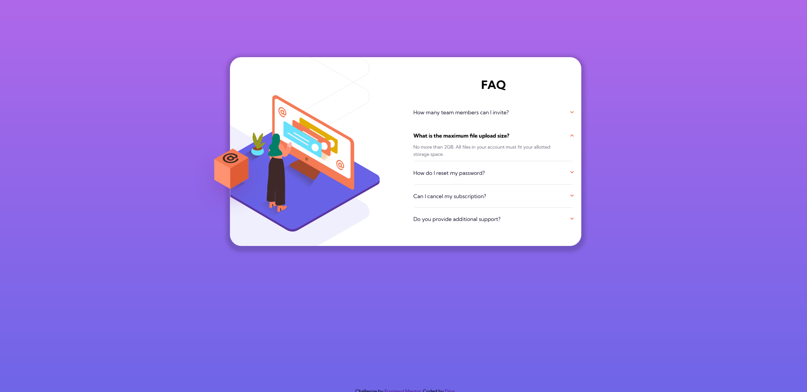

# Frontend Mentor - FAQ accordion card solution

This is a solution to the [FAQ accordion card challenge on Frontend Mentor](https://www.frontendmentor.io/challenges/faq-accordion-card-XlyjD0Oam). Frontend Mentor challenges help you improve your coding skills by building realistic projects. 

## Table of contents

- [Overview](#overview)
  - [The challenge](#the-challenge)
  - [Screenshot](#screenshot)
  - [Links](#links)
- [My process](#my-process)
  - [Built with](#built-with)
  - [What I learned](#what-i-learned)
  - [Continued development](#continued-development)
  - [Useful resources](#useful-resources)
- [Author](#author)

## Overview

### The challenge

Users should be able to:

- View the optimal layout for the component depending on their device's screen size
- See hover states for all interactive elements on the page
- Hide/Show the answer to a question when the question is clicked

### Screenshot

### Links

- Live Site URL: [Add live site URL here](https://your-live-site-url.com)

## My process

### Built with

- Semantic HTML5 markup
- CSS custom properties
- Flexbox
- CSS Grid
- Mobile-first workflow
- Javascript (vanilla)

### What I learned

After I finished my project, I did some extra research and realized I should've used buttons for accordion items instead of DIVs. They improve accessibility and provide free keyboard clicks. 
For the next time, I'll make sure I use buttons for such cases. Styling these buttons can be a bit of a problem, but I believe that after removing the default styles, it should be easier.

There might've been different solutions to a clipped part of an image. I checked other developers' code and realized they used that image as a background. I, however, decided to position it normally, so I had 
a problem how to clip a left part of it. I ended up using the clip-path property and a website where I could upload my image and define which parts would be cut out and by how much.
I also believe my approach was maybe too complex but it gave me the wanted result.

Also Javascript code took me some time to figure out. It was easy and simple enough to just toggle classes and add/remove them as the questions were being clicked.
The hard part was figuring out how to hide one answer of an accordion, when a user clicks on a different question. For that I used a nested loop and used the index value.
I believe, however, there might've been more elegant solutions but for now I made sure I stick to this one.

Rotating arrows also was a new approach. I thought I'd use another svg image, opposite of an arrow up. But then I relized it was unnecessary, as I could simply rotate the arrow in CSS for 180 degrees,
create a class .rotate-arrow and apply it whenever a question was being clicked in Javascript. However, making sure that only the clicked question-arrow rotated, and not all the others took some time to figure out.

I definitely learned the use of index in loops and its value.

### Continued development

I would love to continue working on my Javascript logic. DOM traversing and manipulation is something I will definitely spend more time on.

### Useful resources

(https://www.cssportal.com/css-clip-path-generator/) - This helped me to create a clip-path value for the image, where I needed a left part of it to be cut out.

## Author

- Frontend Mentor - [@d8701a](https://www.frontendmentor.io/profile/d8701a)

